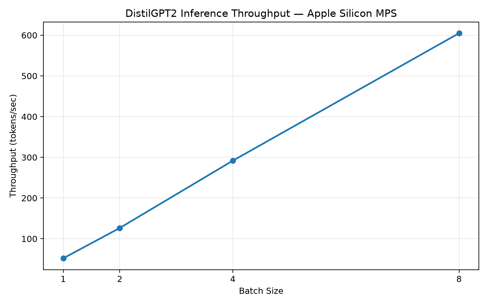
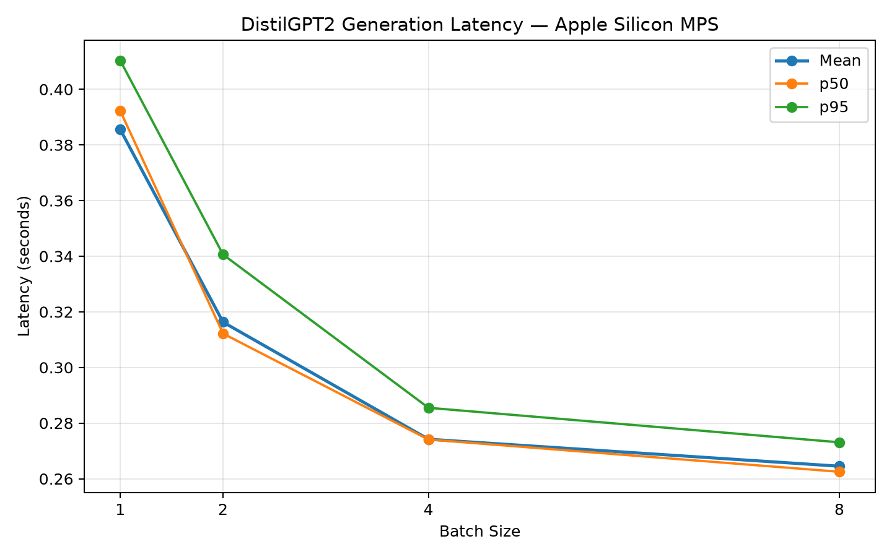

# GPU-Accelerated LLM Inference & Performance Benchmarking

A practical benchmarking project for evaluating **LLM inference latency, throughput, batching behavior, device selection, and memory usage** across local execution environments.

This project currently runs on **Apple Silicon MPS**, with the architecture designed to support future extensions for **CUDA, TensorRT-LLM, vLLM, SGLang, quantization, and multi-GPU inference**.

---

## Overview

The goal of this project is to make LLM inference performance measurable and reproducible.

The benchmark pipeline:

1. Loads a Hugging Face causal language model once
2. Selects CPU, CUDA, or MPS (`--device auto` prefers CUDA, then MPS, then CPU)
3. Tokenizes one or more prompts with **left padding**
4. Warms up generation with device synchronization
5. Runs measured `model.generate()` iterations
6. Records mean / p50 / p95 latency and tokens-per-second
7. Tracks process RSS and device memory when the backend supports it
8. Appends one CSV row per batch size, including OOM failures

---

## Current Features

- PyTorch-based LLM inference
- Hugging Face Transformers integration
- Explicit `--device {auto,cpu,cuda,mps}` (no silent fallback when CUDA/MPS is requested)
- `--dtype {auto,float32,float16,bfloat16}` (`auto` is float32; CPU is always float32)
- Left-padded batched generation
- Multi-batch sweeps with a single model load
- Seeded greedy decode (`do_sample=False`)
- Latency measurement with CUDA/MPS synchronization
- Tokens-per-second from `sum(tokens) / sum(latency)`
- Process RSS and CUDA peak / MPS allocated memory
- CSV logging and a summary report
- Docker support
- Pytest unit tests; optional CPU integration test

---

## Architecture

```text
Prompt
  ↓
Tokenizer (left padding)
  ↓
Transformer Model
  ↓
Inference Runtime
  ↓
CPU / Apple MPS / CUDA
  ↓
Performance Measurement
  ↓
Latency | Throughput | Memory | Batch Size
  ↓
CSV Results
```

---

## Setup

```bash
python -m venv .venv
source .venv/bin/activate
pip install -r requirements.txt
```

Use the project virtualenv for tests. The system Anaconda `python` can segfault when importing NumPy on some macOS setups.

---

## Usage

Single batch:

```bash
python -m src.benchmark --model distilgpt2 --tokens 50 --batch-size 1 --iterations 5
```

Batch-size sweep (model loaded once):

```bash
python -m src.benchmark --batch-sizes 1 2 4 8 --iterations 5 --device auto --seed 42
```

Force CPU or a GPU dtype:

```bash
python -m src.benchmark --device cpu --dtype float32 --iterations 3
python -m src.benchmark --device cuda --dtype float16 --batch-sizes 1 4 8
```

Existing flags are unchanged: `--model`, `--prompt`, `--tokens`, `--batch-size`, `--batch-sizes`, `--iterations`. New optional flags: `--seed`, `--device`, `--dtype`.

Summarize `results/benchmark_results.csv`:

```bash
python -m src.report
```

---

## How metrics are defined

| Metric | Definition |
|---|---|
| `latency_seconds` | Mean wall time of measured `generate()` calls after warmup. CUDA/MPS are synchronized before and after each timed call. |
| `p50_latency_seconds` | 50th percentile of per-iteration latencies (NumPy linear interpolation). |
| `p95_latency_seconds` | 95th percentile. **`None` unless `--iterations >= 5`.** Default `--iterations 1` cannot report a meaningful p95. |
| `tokens_per_second` | `sum(generated tokens across iterations) / sum(latency)`. Token count is `batch_size * (output_len - prompt_len)` per call. |
| `total_generated_tokens` | Mean generated tokens per measured `generate()` call (batch included). |
| `stopped_early` | True if any iteration produced fewer than `max_new_tokens * batch_size` tokens (EOS). |
| `memory_*_mb` | Python process RSS via `psutil`. |
| `device_peak_memory_mb` | CUDA `max_memory_allocated` after a peak-stat reset; MPS uses current allocated memory; CPU is 0. |
| `status` | `ok` or `oom`. Out-of-memory on one batch size is recorded and the sweep continues. |

Latency is **full `generate()` wall time**, not time-to-first-token or inter-token latency.

Warmup is synchronized but not included in latency. Load time is not included: the model is loaded once per process, then each batch size is measured.

---

## Reproducibility

- Default `--seed 42` via `transformers.set_seed`.
- Greedy decoding (`do_sample=False`).
- Result rows include `seed`, `dtype`, `torch_version`, and `transformers_version`.
- Left padding can change batched outputs versus the previous right-padded behavior. Treat that as a methodology change when comparing old CSVs.

---

## Tests

Default suite (no Hub download):

```bash
.venv/bin/pytest -v -m "not integration"
```

Optional DistilGPT2 CPU smoke test:

```bash
RUN_INTEGRATION=1 .venv/bin/pytest -v -m integration
```

---

## Known limitations

- No time-to-first-token or per-token decode timing.
- Same prompt is duplicated for a batch; this measures batching efficiency, not a heterogeneous workload.
- MPS has no CUDA-style peak memory API.
- Catching OOM and calling `empty_cache()` can leave the allocator fragmented.
- `cudnn.deterministic` is not enabled (it can slow CUDA).
- Engines such as vLLM / TensorRT-LLM are not integrated yet.
- Appending to an existing `results/benchmark_results.csv` with a different column set is rejected; move or delete the old file first.

---

## Measured Results — Apple Silicon MPS

A reproducible benchmark run was performed on Apple Silicon using PyTorch MPS with DistilGPT2.

### Benchmark configuration

| Configuration | Value |
|---|---|
| Model | `distilgpt2` |
| Device | Apple Silicon MPS |
| Precision | `float32` |
| PyTorch | `2.13.0` |
| Transformers | `5.15.0` |
| Seed | `42` |
| Max new tokens | `20` |
| Measured iterations | `5` |
| Batch sizes | `1, 2, 4, 8` |

### Performance results

| Batch Size | Mean Latency | p50 Latency | p95 Latency | Throughput |
|---:|---:|---:|---:|---:|
| 1 | 0.3855 s | 0.3922 s | 0.4103 s | 51.88 tokens/s |
| 2 | 0.3163 s | 0.3122 s | 0.3406 s | 126.47 tokens/s |
| 4 | 0.2742 s | 0.2741 s | 0.2855 s | 291.81 tokens/s |
| 8 | 0.2645 s | 0.2625 s | 0.2731 s | **604.88 tokens/s** |

Batch size 8 achieved the highest measured throughput at **604.88 tokens/sec**, compared with **51.88 tokens/sec** at batch size 1. This represents an **11.66x throughput increase** across the tested batch-size range.

Mean generation latency decreased from **0.3855 seconds** at batch size 1 to **0.2645 seconds** at batch size 8.

### Throughput scaling



### Latency scaling



> These measurements represent this specific local Apple Silicon MPS environment and benchmark configuration. They should not be interpreted as CUDA, data-center GPU, or production-serving performance.

### Reproduce this benchmark

```bash
.venv/bin/python -m src.benchmark \
  --model distilgpt2 \
  --tokens 20 \
  --batch-sizes 1 2 4 8 \
  --iterations 5 \
  --device mps \
  --seed 42
```

Generate the report:

```bash
.venv/bin/python -m src.report
```

Generate the benchmark charts:

```bash
.venv/bin/python -m src.visualize
```

